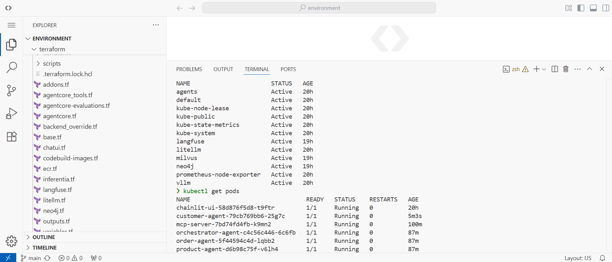
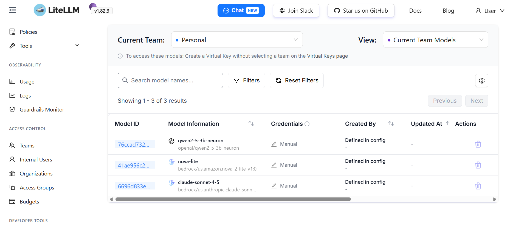

# AI Agents Platform on Kubernetes

A production-oriented AI agent platform built on Kubernetes that combines
self-hosted LLM inference, model routing, RAG, memory, MCP tools,
multi-agent orchestration, observability, evaluation, and knowledge graphs.

## Overview

This project documents my hands-on work building and operating an AI agent
platform on Kubernetes.

The goal was not simply to deploy an LLM.

The goal was to understand the infrastructure and platform components required
to run AI agents as distributed systems.

The platform brings together:

- Kubernetes / Amazon EKS
- AWS Inferentia + Neuron
- vLLM
- Qwen2.5-3B
- LiteLLM
- Strands Agents SDK
- Milvus
- MCP
- A2A
- Langfuse
- OpenTelemetry
- LLM-as-a-Judge
- Neo4j

## What I Explored

- Self-hosted LLM inference on Kubernetes
- Model routing through LiteLLM
- AI agent deployment with Strands Agents SDK
- RAG and conversation memory with Milvus
- Tool integration through MCP
- Multi-agent communication using A2A
- LLM observability with Langfuse and OpenTelemetry
- LLM evaluation using an LLM-as-a-Judge
- Knowledge graph retrieval with Neo4j

## Related Article

I also documented this work in a LinkedIn article:

👉 [Beyond LLMs: The Infrastructure Behind AI Agents](https://lnkd.in/p/digFSPXP)

## Walk-through

1. Kubernetes / EKS Environment 

  

2. Self-Hosted Model Inference 

  

3. LiteLLM Model Gateway 

  

4. Strands AI Agent 

  

5. Langfuse Observability 

  

6. RAG with Milvus 

  

7. Conversation Memory 

  

8. MCP Tool Integration 

  

9. Multi-Agent A2A 

  

10. LLM-as-a-Judge Evaluation 

  

11. Knowledge Graph with Neo4j 

