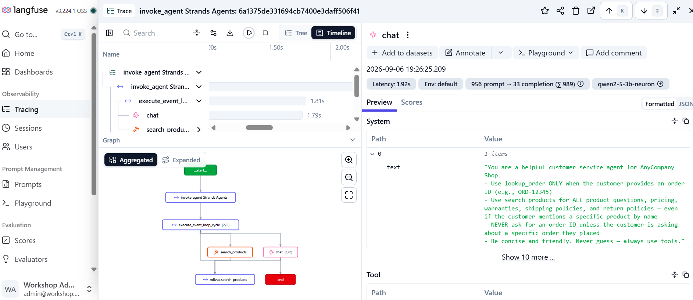
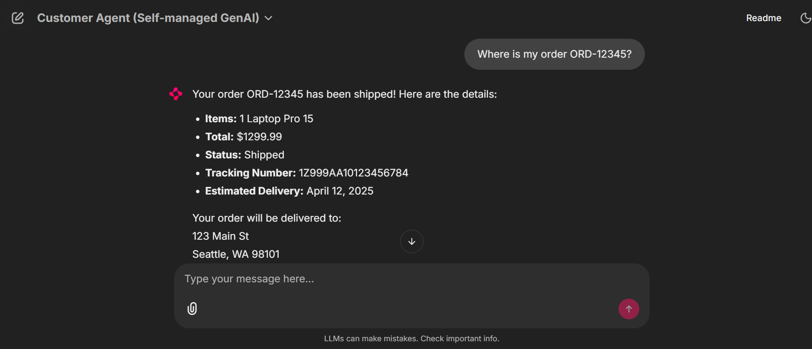
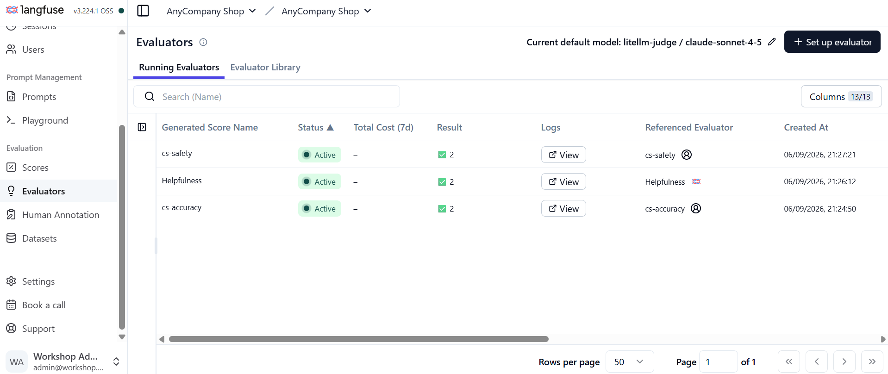
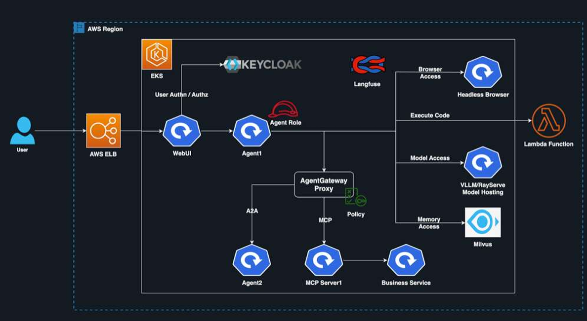

# AI Agents Platform on Kubernetes

A production-oriented AI agent platform built on Kubernetes that combines
self-hosted LLM inference, model routing, RAG, memory, MCP tools,
multi-agent orchestration, observability, evaluation, and knowledge graphs.

## Overview

This project documents my hands-on work building and operating an AI agent
platform on Kubernetes.

The goal was not simply to deploy an LLM.

The goal was to understand the infrastructure and platform components required
to run AI agents as distributed systems.

The platform brings together:

- Kubernetes / Amazon EKS
- AWS Inferentia + Neuron
- vLLM
- Qwen2.5-3B
- LiteLLM
- Strands Agents SDK
- Milvus
- MCP
- A2A
- Langfuse
- OpenTelemetry
- LLM-as-a-Judge
- Neo4j

## What I Explored

- Self-hosted LLM inference on Kubernetes
- Model routing through LiteLLM
- AI agent deployment with Strands Agents SDK
- RAG and conversation memory with Milvus
- Tool integration through MCP
- Multi-agent communication using A2A
- LLM observability with Langfuse and OpenTelemetry
- LLM evaluation using an LLM-as-a-Judge
- Knowledge graph retrieval with Neo4j

## Related Article

I also documented this work in a LinkedIn article:

👉 [The Infrastructure Behind Production Ready AI Agents](https://lnkd.in/p/digFSPXP)

## Walk-through

## Walk-through

1. Kubernetes Environment 
The platform runs on an Amazon EKS cluster, providing the Kubernetes
environment for the AI services and supporting infrastructure. 

  

w. Model Gateway with LiteLLM 
LiteLLM sits between the agent and the model layer, providing a common
interface for model access and routing. 

  

3. LLM Observability with Langfuse 
Langfuse provides visibility into the agent's execution, including
LLM interactions, traces, latency, and usage information. 

  

4. AI Agent Chat Interface 
The Chatlit UI provides the interface for interacting with the deployed
AI agent and sending requests through the platform. 

5. Agent Evaluation 
The evaluation workflow uses an LLM-as-a-Judge approach to assess the
quality of the agent's responses. 

 

6. Overall Architecture 
The architecture brings the Kubernetes infrastructure, model gateway,
agent, observability, and evaluation components together into one platform. 

